# Heart Disease Prediction - MLOps Assignment

This is our Group75 MLOps course assignment where we built an end-to-end ML pipeline for predicting heart disease. The goal was to learn how to take a machine learning model from development to production, covering everything from data acquisition to monitoring.

## What We Built

We created a binary classifier that predicts whether a patient has heart disease based on 13 clinical features from the UCI Heart Disease dataset. The model is deployed as a REST API on a GCP VM, and we set up proper CI/CD, monitoring, and code quality checks.

Live API: http://myprojectdemo.online
Docs: http://myprojectdemo.online/docs

## Architecture

### System Architecture

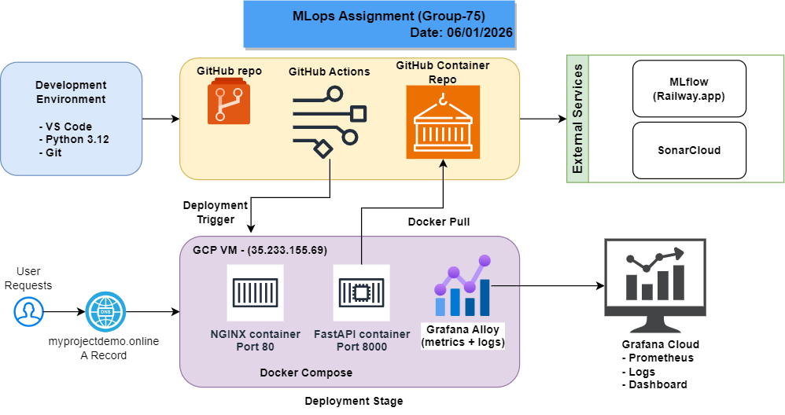

### Data & ML Pipeline Flow


## Quick Links

| Resource           | URL                                                                           |
| ------------------ | ----------------------------------------------------------------------------- |
| Live API           | http://myprojectdemo.online                                                   |
| API Docs           | http://myprojectdemo.online/docs                                              |
| MLflow Experiments | https://mlflow-tracking-production-53fb.up.railway.app/                       |
| Grafana Dashboard  | https://group75mlops.grafana.net/d/suwdlv9/group75-assignment                 |
| SonarCloud         | https://sonarcloud.io/project/overview?id=sudheer628_Group75-MLops-Assignment |
| GitHub Repo        | https://github.com/sudheer628/group75-mlops-assignment                        |

## Tech Stack

- Python 3.12, scikit-learn, FastAPI
- Docker, Docker Compose, Nginx
- GitHub Actions for CI/CD
- MLflow on Railway for experiment tracking
- Grafana Cloud for monitoring
- SonarCloud for code quality
- GCP VM for deployment

## Project Structure

```
.
├── app/                    # FastAPI application
├── src/                    # ML pipeline scripts
│   ├── data_acquisition_eda.py
│   ├── feature_engineering.py
│   ├── experiment_tracking.py
│   ├── model_packaging.py
│   └── feature_store.py
├── tests/                  # Unit tests
├── models/                 # Trained models
├── feature_store/          # Feature store data
├── .github/workflows/      # CI/CD pipelines
├── Dockerfile
├── docker-compose.yml
└── sonar-project.properties
```

## Tasks Completed

### Task 1: Data Acquisition and EDA

We downloaded the UCI Heart Disease dataset and did exploratory analysis. The dataset has 303 samples with 14 features.

Script: `src/data_acquisition_eda.py`

### Task 2: Feature Engineering and Model Training

We engineered 6 new features and trained multiple models (Logistic Regression, Random Forest, Gradient Boosting, SVM). Logistic Regression performed best with ROC-AUC of 0.96.

Script: `src/feature_engineering.py`

### Task 3: Experiment Tracking

We used MLflow hosted on Railway to track all our experiments, parameters, metrics, and model artifacts.

Script: `src/experiment_tracking.py`

### Task 4: Model Packaging

We packaged the trained model with all dependencies for deployment.

Script: `src/model_packaging.py`

### Task 5: CI/CD Pipeline

We set up GitHub Actions with 5 workflows for linting, testing, building containers, and deploying. The pipeline automatically deploys to production when we push to main.

See: [PIPELINE_WORKFLOW.md](docs/PIPELINE_WORKFLOW.md)

### Task 6: Containerization

We containerized the FastAPI application with Docker and used Nginx as reverse proxy.

Files: `Dockerfile`, `docker-compose.yml`, `nginx.conf`

### Task 7: Cloud Deployment

We deployed to a GCP VM with automated deployments via GitHub Actions.

See: [DEPLOYMENT-PLAN.md](docs/DEPLOYMENT-PLAN.md)

### Task 8: Monitoring

We set up Grafana Cloud with Prometheus metrics and Loki logs using Grafana Alloy agent.

See: [MONITORING-PLAN.md](docs/MONITORING-PLAN.md)

### Code Quality

We integrated SonarCloud for static code analysis to catch bugs and code smells.

See: [SONARQUBE.md](docs/SONARQUBE.md)

### Feature Store

We built a simple Parquet-based feature store to ensure training/inference parity.

Script: `src/feature_store.py`

## How to Run Locally

```bash
# Clone and setup
git clone https://github.com/sudheer628/group75-mlops-assignment.git
cd group75-mlops-assignment
conda create -n myenv python=3.12
conda activate myenv
pip install -r requirements.txt

# Run tests
python run_tests.py

# Run individual tasks
python src/data_acquisition_eda.py
python src/feature_engineering.py
```

See [SETUP.md](docs/SETUP.md) for detailed setup instructions.

## API Usage

Make a prediction:

```bash
curl -X POST http://myprojectdemo.online/predict \
  -H "Content-Type: application/json" \
  -d '{"age": 55, "sex": 1, "cp": 3, "trestbps": 140, "chol": 250, "fbs": 0, "restecg": 1, "thalach": 150, "exang": 0, "oldpeak": 1.5, "slope": 2, "ca": 0, "thal": 3}'
```

Response:

```json
{
  "prediction": 1,
  "confidence": 0.85,
  "probabilities": [0.15, 0.85],
  "risk_level": "High"
}
```

## Documentation

| Document                                          | Description                               |
| ------------------------------------------------- | ----------------------------------------- |
| [SETUP.md](docs/SETUP.md)                         | How to set up the development environment |
| [PIPELINE_WORKFLOW.md](docs/PIPELINE_WORKFLOW.md) | CI/CD pipeline explanation                |
| [SONARQUBE.md](docs/SONARQUBE.md)                 | SonarCloud integration                    |
| [DEPLOYMENT-PLAN.md](docs/DEPLOYMENT-PLAN.md)     | GCP deployment and automated deployments  |
| [MONITORING-PLAN.md](docs/MONITORING-PLAN.md)     | Grafana Cloud monitoring setup            |
| [ML-PIPELINE.md](docs/ML-PIPELINE.md)             | ML pipeline flow diagrams                 |

## Screenshots

### GitHub Code Repo

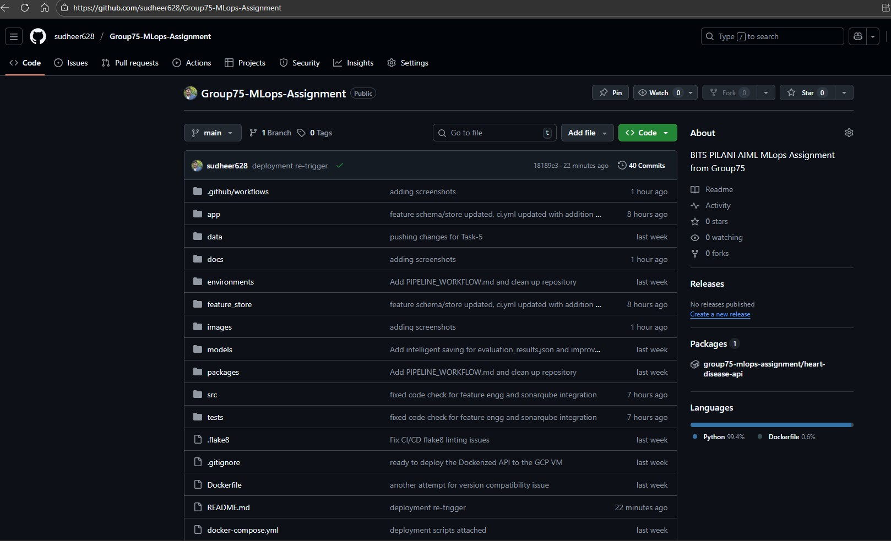

### GHCR (container repo)

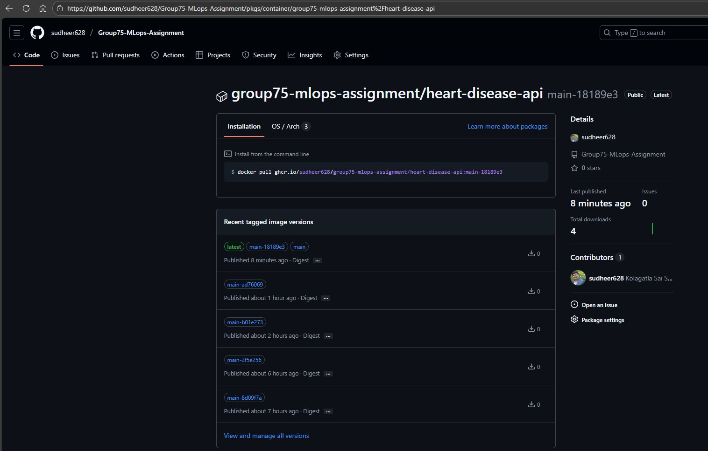

### CI CD Jobs

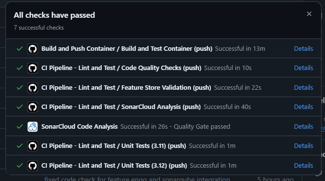

### SonarQube integration through SonarCloud

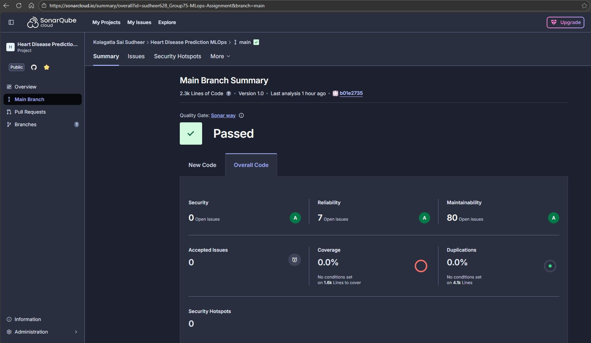

### MLflow

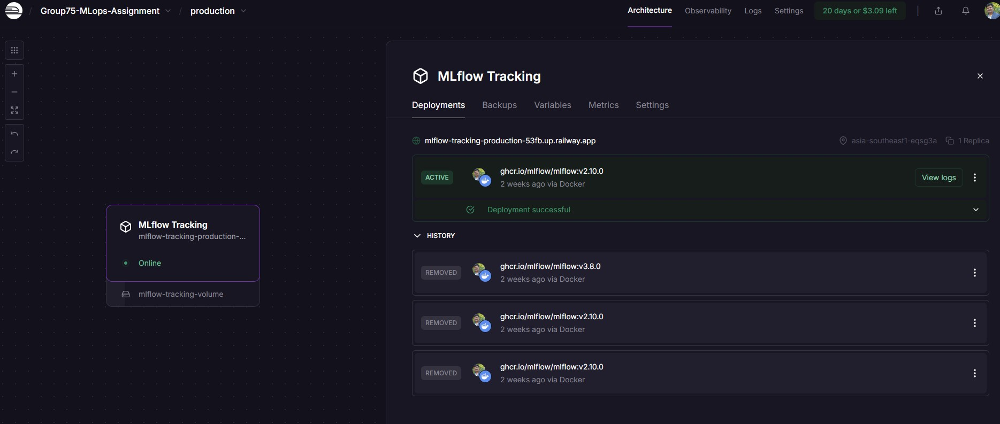

### MLflow Models

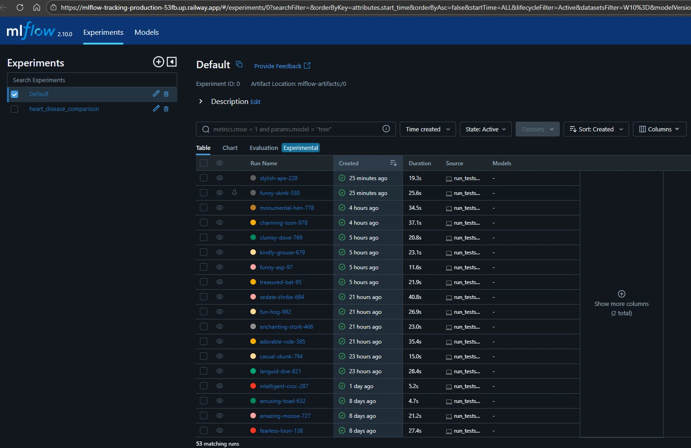

### MLflow Experiments

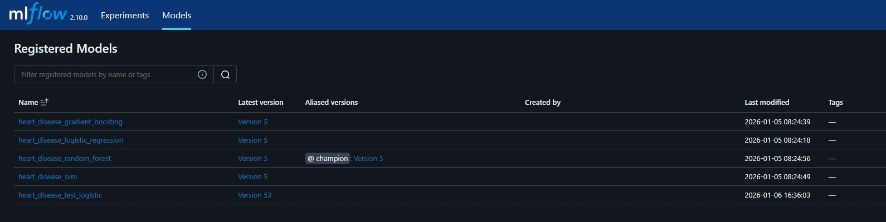

### Grafana Metrics

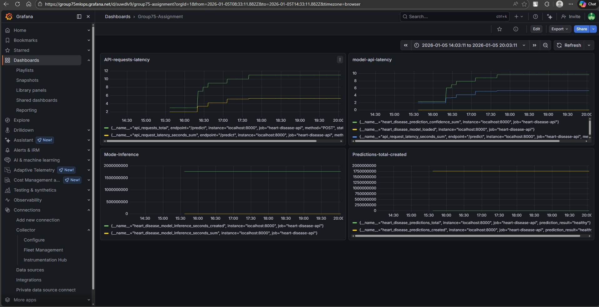

### Grafana Logs1

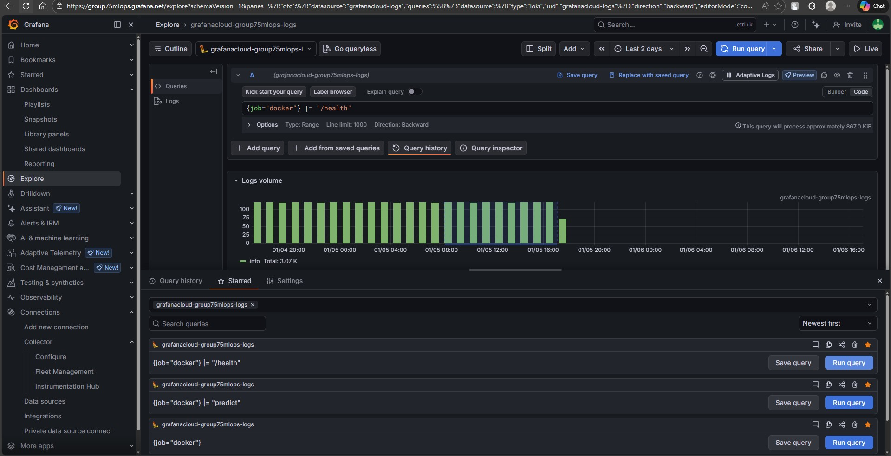

### Grafana Logs2

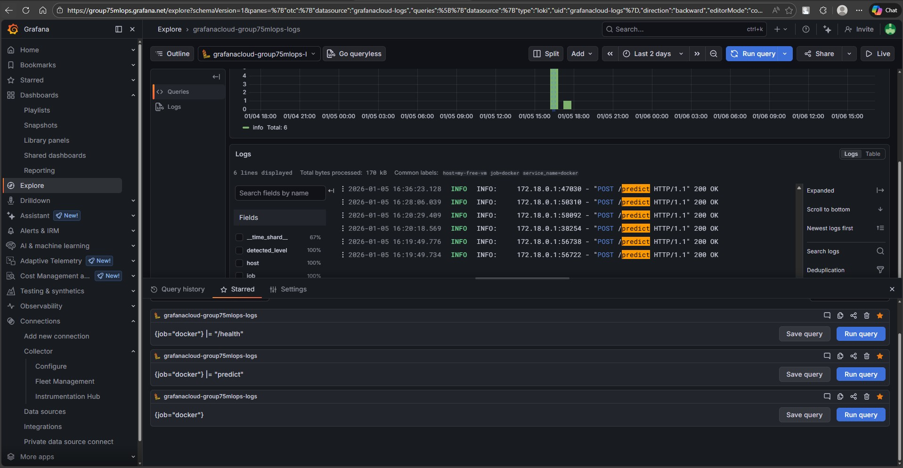

### GCP VM

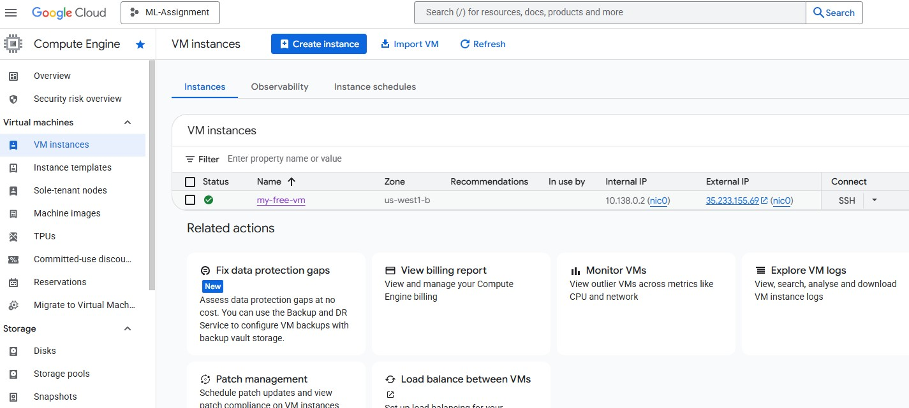

### GCP VM Docker Compose

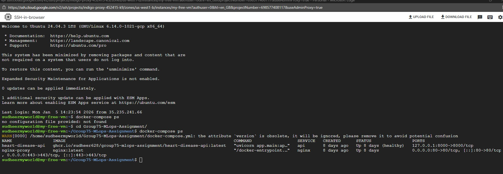

### API Testing

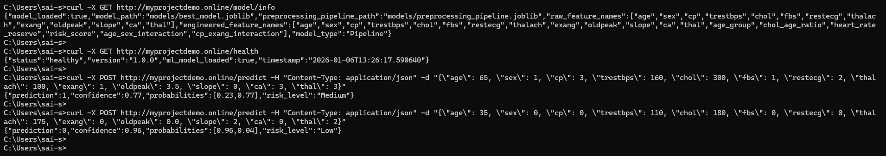

## Team

Group75 - BITS WILP MLOps Course 2025-2026
